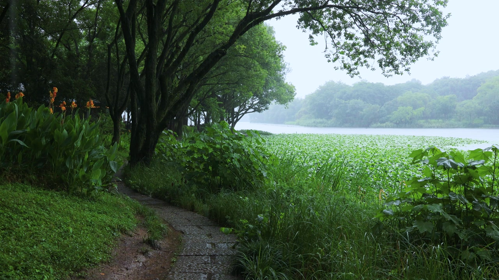

# MVI_6921_密林池塘连绵秋雨 RAIN VST AI 多维度解耦分析

## AI 场景降维推断 (Zero-Shot CLIP)
本分析通过零样本视觉大语言模型，直接将画面特征映射至 RAIN VST 的控制维度。

### 1. Close (近景材质层)
- **最佳匹配**: `雨滴打在开阔的水面、池塘或溪流上 (Raindrops hitting open water, lake, or pond)`
- **置信度**: 48.4%
- **映射结果**: `l1 = 150` (水面 Water)

### 2. Space (空间环境层)
- **最佳匹配**: `被茂密树林和高大树冠完全遮盖的森林深处 (Deep dense forest entirely covered by trees)`
- **置信度**: 84.4%
- **映射结果**: `l2 = 590` (茂密树林 Foliage Dense)

### 3. Distant (远景氛围层)
- **最佳匹配**: `远方是开阔平静的湖泊或水面 (Distant calm lake or water)`
- **置信度**: 50.8%
- **映射结果**: `l3 = 870` (远方雨幕 Distant Veil)

### 4. Rainfall (降雨形态)
- **雨量**: `中等强度的普通降雨，雨势连绵，地面有明显水花 (Moderate steady rainfall with visible splashes)` (34.6%)
- **湿度**: `地面略显干燥，仅有少许水迹，刚开始下雨 (Ground is slightly dry with few water marks, rain just started)` (81.8%)
- **映射结果**: `Density=0.70`, `Intensity=0.45`, `Wetness=0.40`, `Drops=0.36`

## VST 最终参数总结
> ✅ 动态合成预设: **密林池塘连绵秋雨**

| 参数层级 | 参数值 | 说明 |
|---------|---------|------|
| **远景** | 远方雨幕 Distant Veil (l3=870) | AI 环境底噪推断 |
| **空间** | 茂密树林 Foliage Dense (l2=590) | AI 空间反射推断 |
| **近景** | 水面 Water (l1=150) | AI 接触材质推断 |
| **雨量** | 密度=0.70 强度=0.45 | 动态降雨强度映射 |
| **混合** | 湿度=0.40 Blend=0.48 | 空间湿度与远近比例 |
| **全局** | 高通=0.00 低通=0.04 | AI 空间频段雕刻 |