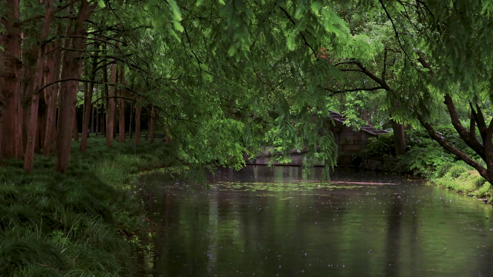

# MVI_6952_密林池塘淅沥小雨 RAIN VST AI 多维度解耦分析

## AI 场景降维推断 (Zero-Shot CLIP)
本分析通过零样本视觉大语言模型，直接将画面特征映射至 RAIN VST 的控制维度。

### 1. Close (近景材质层)
- **最佳匹配**: `雨滴打在开阔的水面、池塘或溪流上 (Raindrops hitting open water, lake, or pond)`
- **置信度**: 38.6%
- **映射结果**: `l1 = 150` (水面 Water)

### 2. Space (空间环境层)
- **最佳匹配**: `被茂密树林和高大树冠完全遮盖的森林深处 (Deep dense forest entirely covered by trees)`
- **置信度**: 79.2%
- **映射结果**: `l2 = 590` (茂密树林 Foliage Dense)

### 3. Distant (远景氛围层)
- **最佳匹配**: `远方是空旷山谷传来的低沉雷雨轰鸣 (Distant low hollow echo from a valley)`
- **置信度**: 42.0%
- **映射结果**: `l3 = 820` (均衡沙沙 Balanced Sizzle)

### 4. Rainfall (降雨形态)
- **雨量**: `淅淅沥沥的小雨，温和绵长，雨丝细腻 (Gentle light rain)` (48.0%)
- **湿度**: `地面完全湿透，潮湿泥泞或有大面积积水倒影 (Ground is completely wet, muddy or flooded with reflections)` (77.0%)
- **映射结果**: `Density=0.50`, `Intensity=0.15`, `Wetness=0.80`, `Drops=0.47`

## VST 最终参数总结
> ✅ 动态合成预设: **密林池塘淅沥小雨**

| 参数层级 | 参数值 | 说明 |
|---------|---------|------|
| **远景** | 均衡沙沙 Balanced Sizzle (l3=820) | AI 环境底噪推断 |
| **空间** | 茂密树林 Foliage Dense (l2=590) | AI 空间反射推断 |
| **近景** | 水面 Water (l1=150) | AI 接触材质推断 |
| **雨量** | 密度=0.50 强度=0.15 | 动态降雨强度映射 |
| **混合** | 湿度=0.80 Blend=0.52 | 空间湿度与远近比例 |
| **全局** | 高通=0.24 低通=0.05 | AI 空间频段雕刻 |