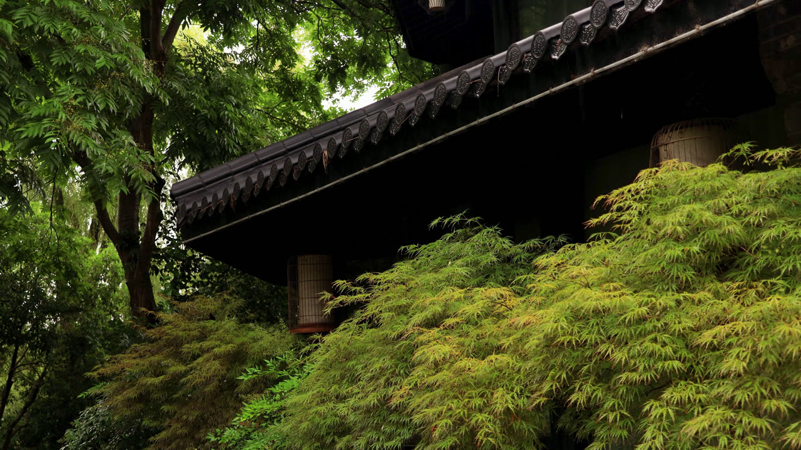

# MVI_6970 RAIN VST 参数分析



## 画面要素分析

| 要素 | 分析 |
|------|------|
| **场景** | 自然场景，未匹配特定类型 |
| **上层 1/3** | 中等绿色植被、整体偏暗、昏暗 |
| **中层 1/3** | 中等绿色植被、部分棕色、整体偏暗、昏暗 |
| **下层 1/3** | 中等绿色植被、部分棕色、有暗部区域 |
| **整体亮度** | 63.2 |
| **绿色占比** | 23.4% |
| **棕色占比** | 7.9% |
| **暗部占比** | 55.1% |
| **水面检测** | 未检测到明显水面 (score=0.2) |

## 声场推理

| 维度 | 判断 | 依据 |
|------|------|------|
| **远景** | Forest Whisper(13) | 默认森林低语远景；低亮度(63)加深远景沉浸；暗部占比高(55%)增加厚度 |
| **空间** | Foliage Dense(06) | 中等植被(23%)适合树冠空间；天空不可见，封闭空间感 |
| **近景** | Dense Foliage(04) | 绿色中占比(23%)适合稀疏植被近景 |
| **雨势** | medium | 默认中等雨量 |
| **距离** | medium | 默认中等距离 |
| **湿度** | 适中 | 默认湿度 |
| **Tonality** | 自然均衡 | 无突出特征，均衡音色 |

## RAIN VST 推荐参数

```
场景名：自然雨景   Natural Rain

远景 Distant:  13 (森林低语 Forest Whisper)
空间 Space:    06 (茂密树林 Foliage Dense)
近景 Close:    04 (茂密植被 Dense Foliage)

Density/Intensity:    45/25
Wetness/Distance:     35/69
MASS/Intensity:       74/52
STRENGTH/Intensity:   64/35
PRESENCE/Intensity:   58/55
```

## 参数设计理由

| 参数 | 值 | 理由 |
|------|-----|------|
| **Density** | 45 | 场景基准密度 45，default 类型默认值 |
| **Intensity (Density)** | 25 | 雨声强度基准 25 |
| **Wetness** | 35 | 湿润度基准 35，适中 |
| **Distance** | 69 | 距离感基准 65，默认中等距离 |
| **MASS** | 74 | 质感基准 72，default 类型默认值 |
| **Intensity (MASS)** | 52 | 质感强度基准 52 |
| **STRENGTH** | 64 | 力度基准 50 |
| **Intensity (STRENGTH)** | 35 | 力度强度基准 35 |
| **PRESENCE** | 58 | 存在感基准 60，自然均衡 |
| **Intensity (PRESENCE)** | 55 | 存在感强度基准 55 |
