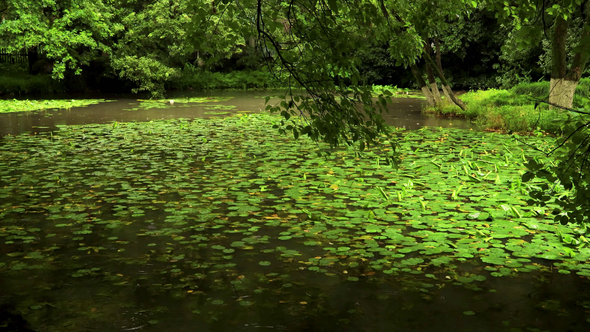

# MVI_7011 RAIN VST 参数分析



## 画面要素分析

| 要素 | 分析 |
|------|------|
| **场景** | 溪流/水面场景，下方有明显水面反射，周围有绿色植被 |
| **上层 1/3** | 茂密绿色植被、整体偏暗、昏暗 |
| **中层 1/3** | 茂密绿色植被 |
| **下层 1/3** | 中等绿色植被、整体偏暗、昏暗 |
| **整体亮度** | 84.3 |
| **绿色占比** | 51.6% |
| **棕色占比** | 1.6% |
| **暗部占比** | 48.1% |
| **水面检测** | 检测到水面 (score=20.5) |

## 声场推理

| 维度 | 判断 | 依据 |
|------|------|------|
| **远景** | Distant Veil(09) | 溪流场景需要柔和远方雨幕；暗部占比高(48%)增加厚度 |
| **空间** | Foliage Dense(06) | 植被密度 52% 适合茂密树林空间 |
| **近景** | Water(17) | 水面检测 (score=21) 适合水面近景；底部偏暗，地面湿润质感 |
| **雨势** | medium | 水面波纹显示中等雨量 |
| **距离** | medium | 水面周围有遮挡，距离感中等 |
| **湿度** | 丰富浸润 | 水面本身增加环境湿润感 |
| **Tonality** | 柔和清透 | 水面反射声能，高频略增 |

## RAIN VST 推荐参数

```
场景名：溪流雨声   Forest Stream Rain

远景 Distant:  09 (远方雨幕 Distant Veil)
空间 Space:    06 (茂密树林 Foliage Dense)
近景 Close:    17 (水面 Water)

Density/Intensity:    46/17
Wetness/Distance:     40/62
MASS/Intensity:       70/50
STRENGTH/Intensity:   71/35
PRESENCE/Intensity:   60/55
```

## 参数设计理由

| 参数 | 值 | 理由 |
|------|-----|------|
| **Density** | 46 | 水面波纹检测 (score=20.5)，提升密度 +6 |
| **Intensity (Density)** | 17 | 雨声强度基准 20 |
| **Wetness** | 40 | 湿润度基准 40，丰富浸润 |
| **Distance** | 62 | 水面近景感强，距离降低 -3 |
| **MASS** | 70 | 质感基准 70，stream 类型默认值 |
| **Intensity (MASS)** | 50 | 质感强度基准 50 |
| **STRENGTH** | 71 | 力度基准 55 |
| **Intensity (STRENGTH)** | 35 | 力度强度基准 35 |
| **PRESENCE** | 60 | 存在感基准 60，柔和清透 |
| **Intensity (PRESENCE)** | 55 | 存在感强度基准 55 |
