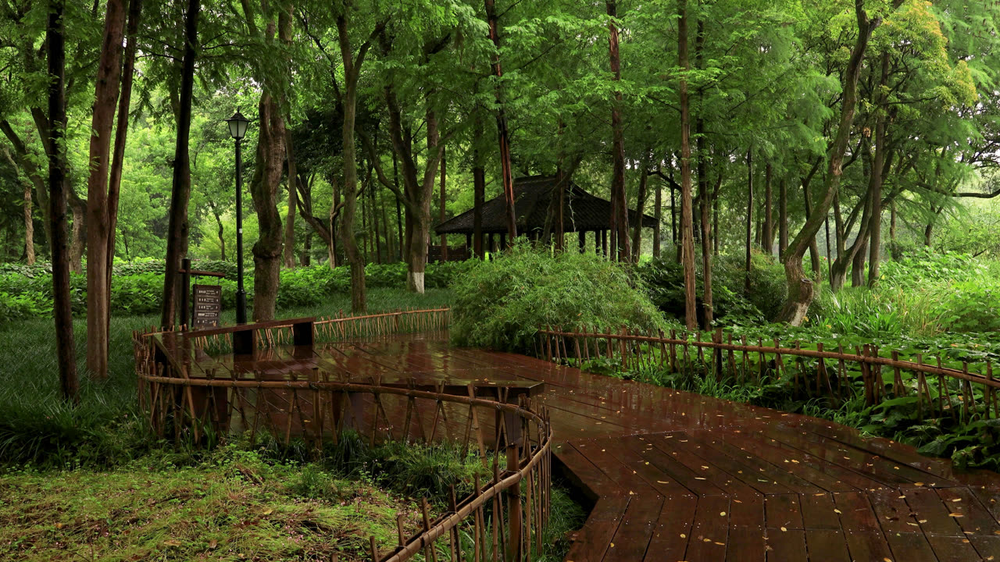

# MVI_6959 RAIN VST 参数分析



## 画面要素分析

| 要素 | 分析 |
|------|------|
| **场景** | 森林/树林场景，大面积绿色植被，亮度偏低 |
| **上层 1/3** | 茂密绿色植被、部分棕色、有暗部区域 |
| **中层 1/3** | 茂密绿色植被、大量棕色（树干/泥土）、有暗部区域 |
| **下层 1/3** | 少量绿色、大量棕色（树干/泥土）、有暗部区域、昏暗 |
| **整体亮度** | 78.0 |
| **绿色占比** | 45.9% |
| **棕色占比** | 26.4% |
| **暗部占比** | 40.7% |
| **水面检测** | 未检测到明显水面 (score=3.6) |

## 声场推理

| 维度 | 判断 | 依据 |
|------|------|------|
| **远景** | Forest Whisper(13) | 森林环境需要低沉远景底噪；低亮度(78)加深远景沉浸；暗部占比高(41%)增加厚度 |
| **空间** | Foliage Dense(06) | 植被密度 46% 适合茂密树林空间 |
| **近景** | Dense Foliage(04) | 绿色高占比(46%)适合茂密植被近景；底部偏暗，地面湿润质感 |
| **雨势** | light | 树冠遮挡大部分雨水 |
| **距离** | far | 密集植被过滤声音，增加距离感 |
| **湿度** | 潮湿厚重 | 树冠截留大量水分，空气湿度高 |
| **Tonality** | 低沉绵密 | 大量树叶吸收高频，低频占主导 |

## RAIN VST 推荐参数

```
场景名：森林细雨   Deep Forest Drizzle

远景 Distant:  13 (森林低语 Forest Whisper)
空间 Space:    06 (茂密树林 Foliage Dense)
近景 Close:    04 (茂密植被 Dense Foliage)

Density/Intensity:    40/13
Wetness/Distance:     30/70
MASS/Intensity:       88/55
STRENGTH/Intensity:   65/30
PRESENCE/Intensity:   60/55
```

## 参数设计理由

| 参数 | 值 | 理由 |
|------|-----|------|
| **Density** | 40 | 场景基准密度 40，forest 类型默认值 |
| **Intensity (Density)** | 13 | 雨声强度基准 15 |
| **Wetness** | 30 | 湿润度基准 30，潮湿厚重 |
| **Distance** | 70 | 距离感基准 70，密集植被过滤声音，增加距离感 |
| **MASS** | 88 | 质感基准 75，forest 类型默认值 |
| **Intensity (MASS)** | 55 | 质感强度基准 55 |
| **STRENGTH** | 65 | 力度基准 50 |
| **Intensity (STRENGTH)** | 30 | 力度强度基准 30 |
| **PRESENCE** | 60 | 存在感基准 60，低沉绵密 |
| **Intensity (PRESENCE)** | 55 | 存在感强度基准 55 |
