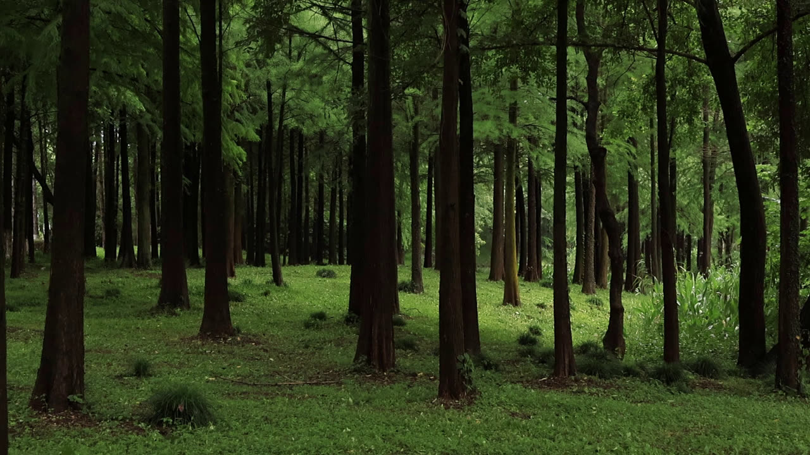

# MVI_7034 RAIN VST 参数分析



## 画面要素分析

| 要素 | 分析 |
|------|------|
| **场景** | 密林树冠，绿色浓密且天空几乎不可见 |
| **上层 1/3** | 茂密绿色植被、整体偏暗、昏暗 |
| **中层 1/3** | 茂密绿色植被、部分棕色、整体偏暗、昏暗 |
| **下层 1/3** | 茂密绿色植被、有暗部区域、昏暗 |
| **整体亮度** | 53.6 |
| **绿色占比** | 48.5% |
| **棕色占比** | 3.5% |
| **暗部占比** | 59.2% |
| **水面检测** | 未检测到明显水面 (score=12.2) |

## 声场推理

| 维度 | 判断 | 依据 |
|------|------|------|
| **远景** | Raindrop Canopy(14) | 密林树冠适合雨落树冠的远景；低亮度(54)加深远景沉浸；暗部占比高(59%)增加厚度 |
| **空间** | Tree Canopy(05) | 植被密度 49% 适合茂密树林空间；天空不可见，封闭空间感 |
| **近景** | Bark(19) | 绿色高占比(49%)适合茂密植被近景 |
| **雨势** | light | 树冠遮挡大部分雨水 |
| **距离** | far | 密集植被过滤声音，增加距离感 |
| **湿度** | 潮湿厚重 | 树冠截留大量水分，空气湿度高 |
| **Tonality** | 低沉绵密 | 大量树叶吸收高频，低频占主导 |

## RAIN VST 推荐参数

```
场景名：密林树冠   Dense Canopy Rain

远景 Distant:  14 (雨落树冠 Raindrop Canopy)
空间 Space:    05 (树冠 Tree Canopy)
近景 Close:    19 (树皮 Bark)

Density/Intensity:    50/27
Wetness/Distance:     40/84
MASS/Intensity:       83/60
STRENGTH/Intensity:   70/40
PRESENCE/Intensity:   47/45
```

## 参数设计理由

| 参数 | 值 | 理由 |
|------|-----|------|
| **Density** | 50 | 场景基准密度 50，canopy 类型默认值 |
| **Intensity (Density)** | 27 | 雨声强度基准 30 |
| **Wetness** | 40 | 湿润度基准 40，潮湿厚重 |
| **Distance** | 84 | 距离感基准 75，密集植被过滤声音，增加距离感 |
| **MASS** | 83 | 质感基准 80，canopy 类型默认值 |
| **Intensity (MASS)** | 60 | 质感强度基准 60 |
| **STRENGTH** | 70 | 力度基准 55 |
| **Intensity (STRENGTH)** | 40 | 力度强度基准 40 |
| **PRESENCE** | 47 | 存在感基准 50，低沉绵密 |
| **Intensity (PRESENCE)** | 45 | 存在感强度基准 45 |
