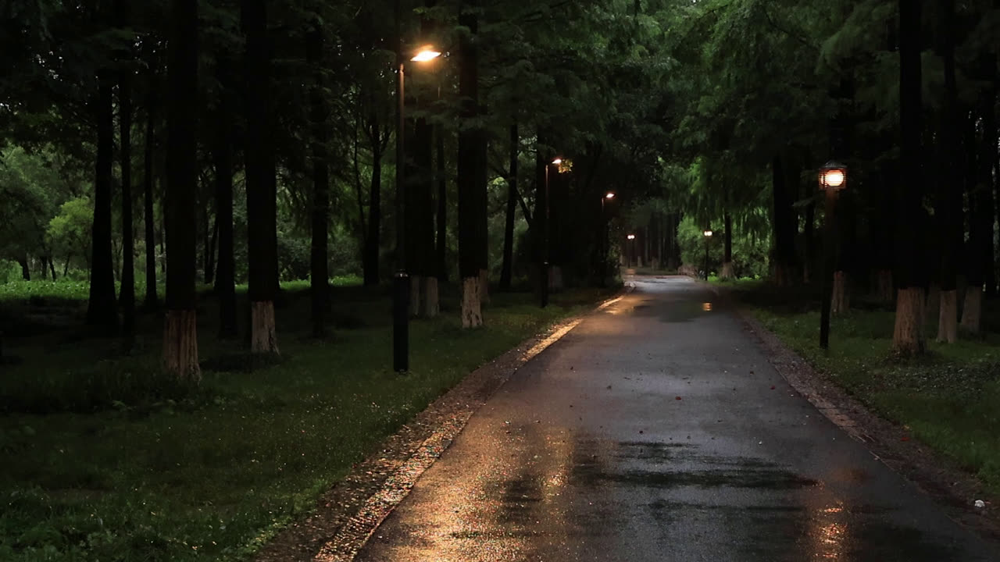

# MVI_7061 RAIN VST 参数分析



## 画面要素分析

| 要素 | 分析 |
|------|------|
| **场景** | 夜间场景，整体亮度很低 |
| **上层 1/3** | 少量绿色、整体偏暗、昏暗 |
| **中层 1/3** | 少量绿色、部分棕色、整体偏暗、昏暗 |
| **下层 1/3** | 大量棕色（树干/泥土）、整体偏暗、昏暗 |
| **整体亮度** | 36.7 |
| **绿色占比** | 7.9% |
| **棕色占比** | 10.8% |
| **暗部占比** | 81.7% |
| **水面检测** | 未检测到明显水面 (score=4.5) |

## 声场推理

| 维度 | 判断 | 依据 |
|------|------|------|
| **远景** | Immersive Curtain(15) | 夜间场景需要沉浸包裹的远景；低亮度(37)加深远景沉浸；暗部占比高(82%)增加厚度 |
| **空间** | Tree Canopy(05) | 植被稀疏，使用开放空间预设；天空不可见，封闭空间感 |
| **近景** | Dense Foliage(04) | 默认茂密植被近景；底部偏暗，地面湿润质感 |
| **雨势** | medium | 夜间雨量中等，视觉辨识度低 |
| **距离** | medium | 夜间缺少远景参照，中等距离感 |
| **湿度** | 湿润深沉 | 暗部像素占比高，整体沉浸感强 |
| **Tonality** | 低沉温暖 | 夜景缺少高频视觉信息，声场偏暖 |

## RAIN VST 推荐参数

```
场景名：夜间雨林   Conifer Night Rain

远景 Distant:  15 (沉浸雨幕 Immersive Curtain)
空间 Space:    05 (树冠 Tree Canopy)
近景 Close:    04 (茂密植被 Dense Foliage)

Density/Intensity:    55/35
Wetness/Distance:     50/69
MASS/Intensity:       91/55
STRENGTH/Intensity:   84/50
PRESENCE/Intensity:   50/45
```

## 参数设计理由

| 参数 | 值 | 理由 |
|------|-----|------|
| **Density** | 55 | 场景基准密度 55，night 类型默认值 |
| **Intensity (Density)** | 35 | 雨声强度基准 35 |
| **Wetness** | 50 | 湿润度基准 50，湿润深沉 |
| **Distance** | 69 | 距离感基准 60，夜间缺少远景参照，中等距离感 |
| **MASS** | 91 | 质感基准 85，night 类型默认值 |
| **Intensity (MASS)** | 55 | 质感强度基准 55 |
| **STRENGTH** | 84 | 力度基准 70 |
| **Intensity (STRENGTH)** | 50 | 力度强度基准 50 |
| **PRESENCE** | 50 | 存在感基准 55，低沉温暖 |
| **Intensity (PRESENCE)** | 45 | 存在感强度基准 45 |
