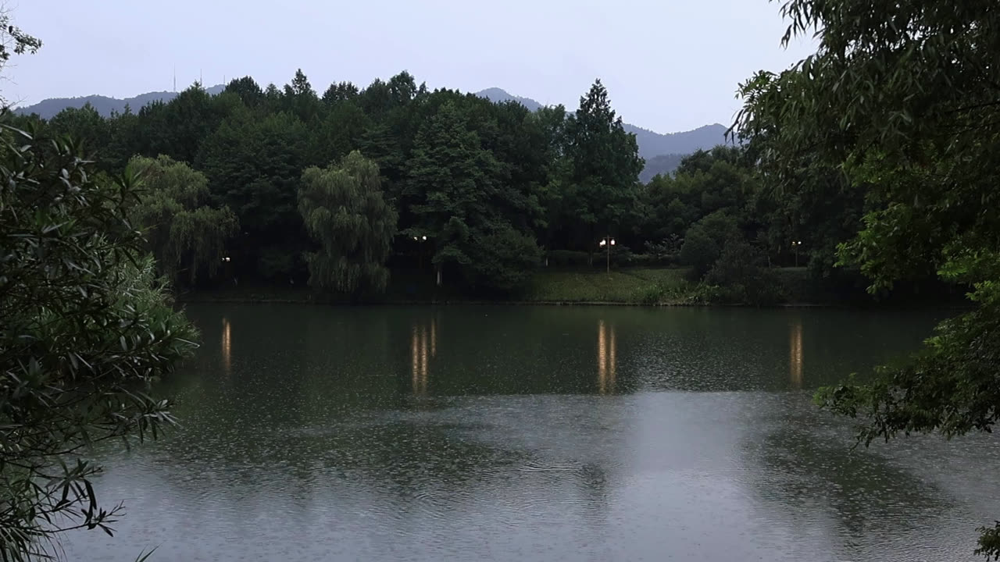

# MVI_7063 RAIN VST 参数分析



## 画面要素分析

| 要素 | 分析 |
|------|------|
| **场景** | 湖泊/开阔水面，下方区域检测到水面特征 |
| **上层 1/3** | 少量绿色、明显蓝色（天空/水面）、有暗部区域 |
| **中层 1/3** | 少量绿色、整体偏暗、昏暗 |
| **下层 1/3** | 少量绿色、明显蓝色（天空/水面）、有暗部区域 |
| **整体亮度** | 85.5 |
| **绿色占比** | 12.1% |
| **棕色占比** | 0.6% |
| **暗部占比** | 57.5% |
| **水面检测** | 检测到水面 (score=37.5) |

## 声场推理

| 维度 | 判断 | 依据 |
|------|------|------|
| **远景** | Chilly Pouring(07) | 湖泊场景适合寒流/远景雨声；暗部占比高(58%)增加厚度 |
| **空间** | Foliage Dense(06) | 植被稀疏，使用开放空间预设；大面积天空，开放空间感 |
| **近景** | Water(17) | 水面检测 (score=38) 适合水面近景 |
| **雨势** | medium | 水面波纹显示中等雨量 |
| **距离** | far | 开阔水面提供远距离感 |
| **湿度** | 丰富浸润 | 水面本身增加环境湿润感 |
| **Tonality** | 柔和清透 | 水面反射声能，高频略增 |

## RAIN VST 推荐参数

```
场景名：湖畔轻雨   Lake Light Rain

远景 Distant:  07 (寒流雨声 Chilly Pouring)
空间 Space:    06 (茂密树林 Foliage Dense)
近景 Close:    17 (水面 Water)

Density/Intensity:    56/25
Wetness/Distance:     35/63
MASS/Intensity:       78/55
STRENGTH/Intensity:   79/45
PRESENCE/Intensity:   55/55
```

## 参数设计理由

| 参数 | 值 | 理由 |
|------|-----|------|
| **Density** | 56 | 水面波纹检测 (score=37.5)，提升密度 +11 |
| **Intensity (Density)** | 25 | 雨声强度基准 25 |
| **Wetness** | 35 | 湿润度基准 35，丰富浸润 |
| **Distance** | 63 | 水面近景感强，距离降低 -6 |
| **MASS** | 78 | 质感基准 78，lake 类型默认值 |
| **Intensity (MASS)** | 55 | 质感强度基准 55 |
| **STRENGTH** | 79 | 力度基准 65 |
| **Intensity (STRENGTH)** | 45 | 力度强度基准 45 |
| **PRESENCE** | 55 | 存在感基准 55，柔和清透 |
| **Intensity (PRESENCE)** | 55 | 存在感强度基准 55 |
